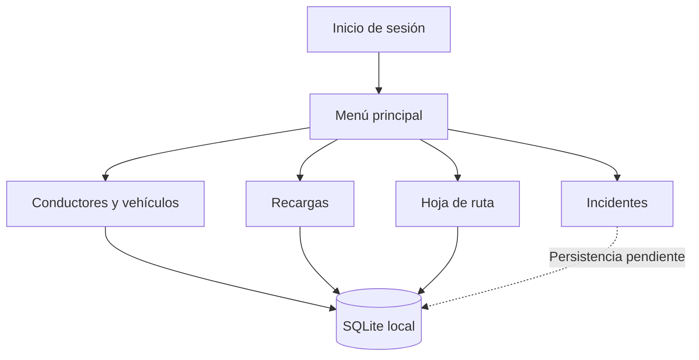

# Bitácora para Conductores

Aplicación móvil académica para registrar información operativa relacionada con conductores, vehículos, recargas de combustible, actividades de ruta e incidentes.

> **Estado del proyecto:** prototipo universitario desarrollado en 2022 y conservado como evidencia de aprendizaje. El repositorio refleja el alcance alcanzado durante el proyecto académico; no representa una aplicación terminada ni preparada para producción.

## Contexto académico

Este proyecto fue desarrollado como parte de la formación universitaria en Ingeniería en Informática. Su objetivo fue aplicar conceptos de desarrollo móvil multiplataforma, interfaces XAML, navegación entre pantallas, persistencia local con SQLite, separación de código compartido y funciones específicas de cada plataforma.

La aplicación se construyó con Xamarin.Forms y contiene proyectos para Android e iOS, además de una biblioteca compartida con las pantallas, modelos y lógica principal.

## Problema que buscaba resolver

Una bitácora vehicular en papel o distribuida en varios archivos dificulta consultar rápidamente:

- qué conductor fue relacionado con un vehículo;
- qué recargas de combustible se realizaron;
- qué actividades o recorridos fueron registrados;
- qué incidentes ocurrieron durante la operación;
- qué información histórica se encuentra almacenada en el dispositivo.

El prototipo reúne estos registros en una aplicación móvil y utiliza una base SQLite local para mantener la información disponible en el dispositivo.

## Funciones contempladas

- acceso mediante una pantalla de inicio de sesión de demostración;
- registro de datos del conductor;
- registro de datos del vehículo;
- consulta, actualización y eliminación de conductores;
- registro y consulta de recargas de combustible;
- actualización y eliminación de recargas;
- registro de actividades de una hoja de ruta;
- consulta del detalle de actividades;
- captura de una fotografía asociada visualmente a un incidente;
- almacenamiento local mediante SQLite;
- navegación entre módulos con Xamarin.Forms.

## Estado real de los módulos

| Módulo | Estado en el repositorio | Observaciones |
| --- | --- | --- |
| Inicio de sesión | Demostración | Utiliza las credenciales fijas `admin` / `admin`. No es un sistema de autenticación para producción. |
| Conductores | Parcialmente implementado | Incluye formulario, inserción, listado, detalle, actualización y eliminación. El aprovisionamiento inicial de tablas requiere corrección. |
| Vehículos | Parcialmente implementado | El formulario crea el modelo e intenta almacenarlo, pero falta completar la consulta y administración de vehículos. |
| Recargas | Parcialmente implementado | Incluye registro, listado, detalle, actualización y eliminación. La actualización requiere corregir el orden de kilometraje y estación. |
| Hoja de ruta | Parcialmente implementado | Permite registrar, listar y consultar actividades. No incluye todavía edición ni eliminación. |
| Incidentes | Prototipo de interfaz | Incluye descripción y captura de fotografía, pero la persistencia del incidente quedó pendiente. |
| Android | Implementación principal | Contiene el servicio SQLite específico, actividad principal, recursos y permisos básicos. |
| iOS | Estructura inicial | El proyecto existe, pero necesita completar el servicio SQLite, permisos de cámara y validación en un entorno Apple compatible. |

## Flujo de navegación



La aplicación inicia en `Login.xaml`. Después de validar las credenciales de demostración, abre `Menu.xaml`, desde donde se accede a los formularios y pantallas de consulta.

## Arquitectura

La solución está dividida en tres proyectos:

```text
ProyectoAppMovil_BitacoraConductores/
├── ProyectoAppMovil/              Código compartido
│   ├── Asignacion/                Conductores y vehículos
│   ├── Recarga/                   Recargas de combustible
│   ├── Hoja de Ruta/              Actividades y recorridos
│   ├── Incidente/                 Descripción y fotografía
│   ├── Datos/                     Contrato de acceso a SQLite
│   ├── Tablas/                    Modelos de persistencia
│   ├── Login.xaml                 Pantalla inicial
│   ├── Menu.xaml                  Navegación principal
│   └── Registros.xaml             Acceso a históricos
├── ProyectoAppMovil.Android/      Inicio, recursos y SQLite para Android
├── ProyectoAppMovil.iOS/          Estructura de la aplicación para iOS
└── ProyectoAppMovil.sln           Solución de Visual Studio
```

### Acceso a datos

El proyecto compartido define `ISQLiteDB`. Android implementa esa interfaz mediante `DependencyService` y crea la conexión a:

```text
BitacoraSQLite.db3
```

La base se almacena en el directorio de documentos de la aplicación.

### Modelos principales

- `Empleado`: datos básicos previstos para usuarios.
- `T_Conductor`: código, nombre, apellido, edad, cédula, licencia y tipo de sangre.
- `T_Vehiculo`: número, modelo, placa y estado.
- `T_Recarga`: fecha, ticket, galones, valor, kilometraje y estación.
- `T_Actividad`: actividad, login, horarios, destino y fecha.
- `T_Incidente`: descripción del incidente.
- `FotoViewModel`: captura y presentación de fotografías mediante el complemento de medios.

## Tecnologías utilizadas

- C#;
- XAML;
- Xamarin.Forms `5.0.0.2196`;
- .NET Standard `2.0`;
- SQLite y `sqlite-net-pcl 1.8.116`;
- Xamarin.Essentials `1.7.0`;
- Xam.Plugin.Media `5.0.1`;
- patrón MVVM básico para la captura de fotografías;
- `DependencyService` para servicios específicos de plataforma;
- proyectos Android e iOS.

## Entorno original

La solución fue creada para el ecosistema Xamarin de Visual Studio. El proyecto Android utiliza Xamarin.Android con `TargetFrameworkVersion v12.0`; su manifiesto declara Android mínimo API 19 y objetivo API 30.

Xamarin dejó de recibir soporte oficial de Microsoft el 1 de mayo de 2024. Por esta razón, el proyecto debe considerarse código histórico y puede no compilar directamente con una instalación moderna de Visual Studio o con el comando actual `dotnet build`.

- [Política oficial de soporte de Xamarin](https://dotnet.microsoft.com/platform/support/policy/xamarin)
- [Guía oficial de migración de Xamarin.Forms a .NET MAUI](https://learn.microsoft.com/dotnet/maui/migration/)

## Cómo intentar reproducir el proyecto original

Se necesita un entorno histórico compatible con Xamarin.Forms, Xamarin.Android, el SDK de Android y los paquetes NuGet utilizados por la solución.

1. Clonar el repositorio.
2. Abrir `ProyectoAppMovil.sln` en una instalación compatible de Visual Studio con Xamarin.
3. Restaurar los paquetes NuGet.
4. Seleccionar `ProyectoAppMovil.Android` como proyecto de inicio.
5. Configurar un emulador o dispositivo Android compatible.
6. Compilar y ejecutar en modo `Debug`.
7. Ingresar con las credenciales de demostración:

```text
Usuario: admin
Contraseña: admin
```

Estas credenciales están escritas en el código y deben usarse únicamente para revisar el prototipo.

## Verificación técnica realizada

Durante una revisión aislada del repositorio realizada el 13 de agosto de 2026:

- se inspeccionó la solución completa y la navegación entre módulos;
- se revisaron los modelos SQLite y las implementaciones específicas de plataforma;
- se validaron estructuralmente 24 archivos XAML, XML y de proyecto sin encontrar XML mal formado;
- se confirmó que el repositorio no publica APK, ejecutables, etiquetas ni releases;
- no se pudo iniciar la interfaz porque el entorno de revisión no incluía la cadena de herramientas histórica de Xamarin, MSBuild, Android SDK ni un emulador.

Por lo tanto, esta revisión confirma la estructura y el alcance del código, pero no certifica una compilación actual ni una ejecución completa en Android o iOS.

## Limitaciones conocidas

- autenticación fija de demostración;
- inicialización incompleta de algunas tablas en el primer uso;
- operaciones SQLite asíncronas que todavía deben esperarse y manejar errores;
- suscripciones duplicadas a ciertos eventos `Clicked`;
- módulo de incidentes sin persistencia terminada;
- administración de vehículos incompleta;
- edición y eliminación de actividades pendientes;
- implementación SQLite para iOS pendiente;
- imágenes de interfaz cargadas desde direcciones externas;
- ausencia de pruebas automatizadas;
- dependencias y plataforma Xamarin fuera de soporte.

## Consideraciones de seguridad

El proyecto es exclusivamente educativo. No debe utilizarse para almacenar información operativa real sin realizar antes, como mínimo, estos cambios:

- reemplazar `admin/admin` por autenticación segura;
- validar y sanear todos los datos de entrada;
- centralizar la creación y migración del esquema SQLite;
- cifrar datos sensibles almacenados en el dispositivo;
- controlar permisos de cámara y archivos por plataforma;
- manejar correctamente errores y operaciones asíncronas;
- agregar pruebas unitarias y de integración;
- retirar recursos externos no controlados.

## Ruta recomendada de modernización

Una evolución actual del proyecto debería realizarse en .NET MAUI:

1. crear una solución .NET MAUI nueva;
2. migrar los modelos y separar la lógica de datos de las páginas;
3. sustituir `DependencyService` por inyección de dependencias;
4. centralizar SQLite en un repositorio con migraciones e inicialización única;
5. implementar autenticación local segura;
6. reemplazar el complemento de cámara por APIs compatibles con .NET MAUI;
7. convertir los eventos duplicados en comandos o manejadores únicos;
8. completar incidentes, vehículos y actividades;
9. agregar validaciones, pruebas y CI;
10. probar Android e iOS en dispositivos reales.

## Aprendizajes demostrados

Aunque el prototipo no está terminado, el repositorio documenta experiencia académica en:

- diseño de interfaces móviles con XAML;
- programación orientada a objetos en C#;
- navegación entre páginas;
- persistencia SQLite;
- operaciones CRUD;
- separación de código compartido y específico de plataforma;
- uso de cámara y enlace de datos;
- modelado de entidades operativas;
- identificación posterior de deuda técnica y oportunidades de mejora.

## Autor

**Jimmy Omar Toapanta Guayanay**  
Ingeniero en Informática — Quito, Ecuador

Repositorio: [github.com/eslay07/ProyectoAppMovil_BitacoraConductores](https://github.com/eslay07/ProyectoAppMovil_BitacoraConductores)
